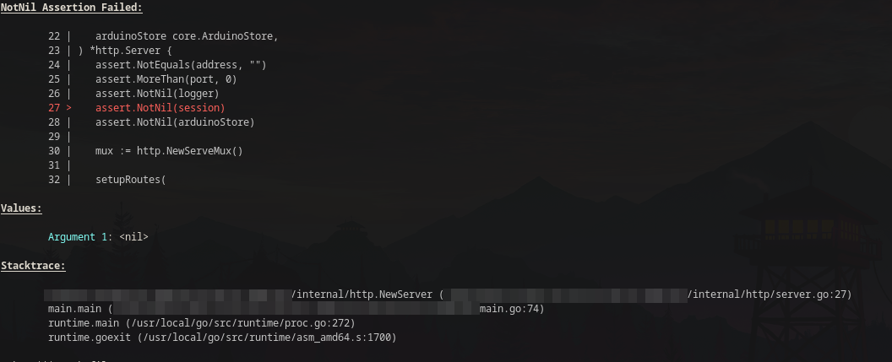

Assert
======

Example Output
--------------

**Note:** The display of the source code is heavily inspired by the
[ztrue/tracerr](https://github.com/ztrue/tracerr) module. Its dependent on
running on the machine the code was compiled on. Asserts shouldn't be used in
production code anyway.

Usage
-----

Add the `assert` tag to the build command to include the asserts in the code.
If the tag is not present, all assert turn into no-ops.

All asserts are self describing, apart from `Always` and `Never`, which are
mean to be used like in the SQLite codebase.

* `Equals[T comparable](a, b T)`
* `NotEquals[T comparable](a, b T)`
* `LessThan[T cmp.Ordered](a, b T)`
* `MoreThan[T cmp.Ordered](a, b T)`
* `LessOrEquals[T cmp.Ordered](a, b T)`
* `MoreOrEquals[T cmp.Ordered](a, b T)`
* `Nil(v any)`
* `NotNil(v any)`
* `Always(v bool) bool`
* `Never(v bool) bool`

Configuration
-------------

The following global variables can be set to change the behavior of the module:

### `Writer`

The `io.Writer` to write the output to. Default is `os.Stderr`.

### `ContextWindow`

The number of source code lines to display around the assert. Default is `5`.

### `MaxTraceDepth`

The maximum number of stack frames to display. Default is `20`.

### `ReturnValue`

The return value of the program when an assert fails. Default is `1`.

### `SectionTitleColor`

ANSI escape code for the section title. Default is bold underlined.

### `ContextColor`

ANSI escape code for the context lines. Default is light gray.

### `LineColor`

ANSI escape code for the line with the assert. Default is red.

### `ArgumentColor`

ANSI escape code for the `Argument X` part in the `Values` section.

### `StackColor`

ANSI escape code for the stack frames. Default is gray.
